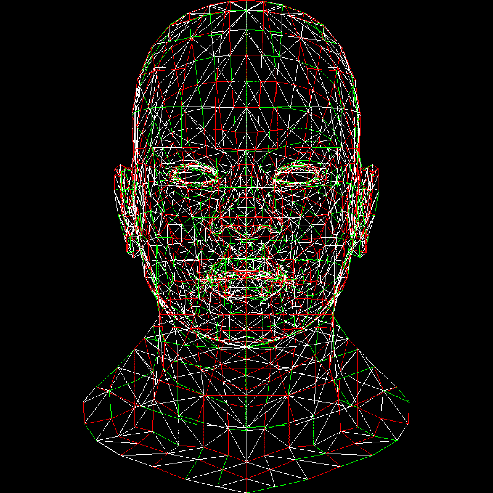

# Siren | SimpleRenderer

Siren is a lightweight Cross Platform C++ program designed to render Wavefront .obj files into images. It provides a simple and efficient way to visualize 3D models without the need for complex graphics libraries.

## Features

- Rendering of Wavefront .obj files
- Support for basic material properties (e.g., diffuse color, specular color, shininess)
- Adjustable camera settings (e.g., position, orientation, field of view)
- Basic lighting support (ambient, diffuse, specular)

## Dependencies

Siren does not depent any other graphics rendering library such as OpenGL or DirectX, the whole philosphy of Siren is rendering obj files without depending large third party libraries.
The only dependency that Siren have is my own [TGA Image Library](https://github.com/lvntky/targalib) which used for generating rendered objects as `.tga` image files. Targalib is very compact header only library, check out the Targalib repository for more information.

## Getting Stated

Siren uses CMake as a build tool. You can compile the source code as:

1. clone the repository
```bash
git clone https://github.com/lvnyky/siren.git
```

2. create a build directory
```bash
 mkdir build
 cd build/
```
3. generate makefiles
```bash
cmake ..
```
4 then build it
```
make
```


## Contributing

Contributions to Siren are welcome! If you have any ideas for improvements or new features, feel free to open an issue or submit a pull request.
And don't forget to look [Contrubuting](./CONTRIBUTING.md) page.

## License

This project is licensed under the MIT License - see the [LICENSE](LICENSE) file for details.

## Contact

For questions or feedback, please contact leventkayadev [at] gmail [dot] com.

## Showcase
- First Wiremesh Rendering
    - 